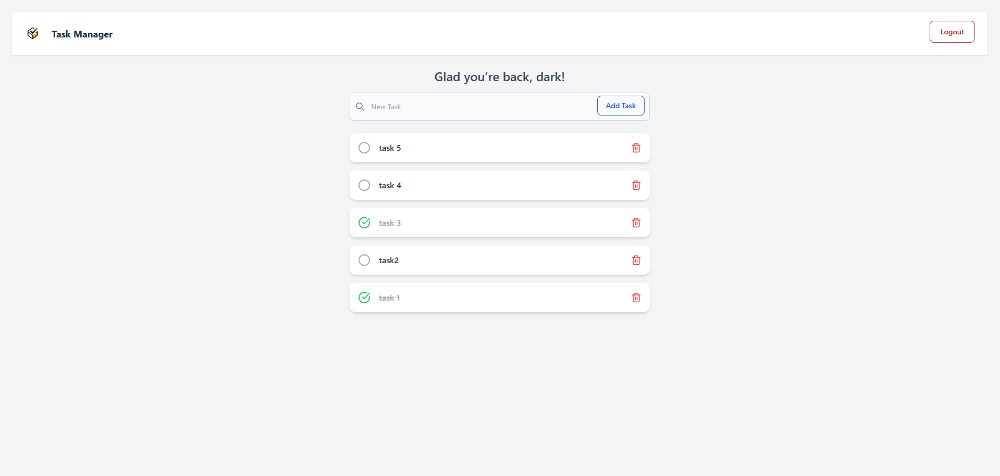

# Task-ManagerJS

> A simple full-stack JavaScript task manager with user auth, CRUD operations, and a clean React UI.

---

<p align="center">
  
  
</p>

---

## 🔧 Tech Stack

- **Frontend**: React, React Router, Tailwind CSS, Axios  
- **Backend**: Node.js, Express, MongoDB (Mongoose), JWT  
- **Dev Tools**: ESLint, Prettier, Nodemon, Concurrently  

---

## 🚀 Getting Started

### 1. Clone & enter repo

```bash
git clone https://github.com/RedaSatrallah/Task-managerJS.git
cd Task-managerJS
