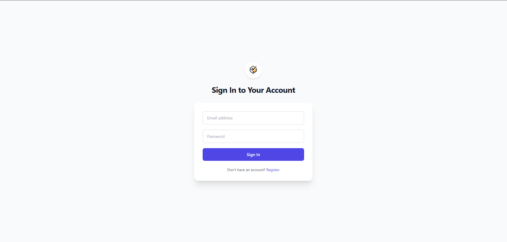

# Task-ManagerJS

> A full-stack JavaScript task manager with authentication, task CRUD, and a modern React UI.

---

<p align="center">
  
  
</p>

---

## 🔧 Tech Stack

- **Frontend**: React, React Router DOM, Tailwind CSS, Axios  
- **Backend**: Node.js, Express, MongoDB (Mongoose), JWT  
- **Dev Tools**: ESLint, Prettier, Nodemon, Concurrently  

---

## 🚀 Getting Started

### 1. Clone the Repository

```bash
git clone https://github.com/RedaSatrallah/Task-managerJS.git
cd Task-managerJS
```

### 2. Install Dependencies

#### Backend
```bash
cd server
npm install
```

#### Frontend
```bash
cd ../client
npm install
```

### 3. Set Up Environment Variables

Create a `.env` file in the `server` directory with:

```
PORT=5000
MONGO_URI=your_mongodb_connection_string
JWT_SECRET=your_secret_key
```

### 4. Run the Project

From the root directory:

```bash
npm run dev
```

This will start both the backend and frontend using `concurrently`.

---

## 📁 Folder Structure

```
Task-managerJS/
├── client/      # React frontend
├── server/      # Express backend
├── screenshots/ # UI screenshots
├── .gitignore
└── README.md
```
---

## 🧠 Features

- User registration & login (JWT)
- Add, update, and delete tasks
- Responsive UI with Tailwind CSS
- Protected dashboard
- MongoDB for persistent data

---

## 🧑‍💻 Author

Made by [Reda Satrallah](https://github.com/RedaSatrallah)

---

## 📜 License

This project is licensed under the MIT License.
